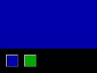
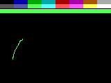
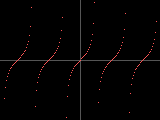
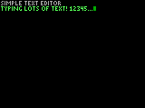
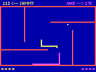
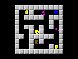

# Immediate2D Drawing Framework
A C++ drawing framework for Windows that makes simple graphics programming as much fun as the days when computers booted directly to a BASIC prompt.

Made for beginners and classrooms.  To use this framework: open Visual Studio, choose "Create a new project", select the "Windows Desktop Wizard" from the list, (give your project a name), choose "Desktop Application (.exe)" from the wizard, and check the "Empty Project" box.  Then, add **immediate2d.h** and some new cpp file for your own code to the project.  Add a `#define IMM2D_IMPLEMENTATION` just before `#include "immediate2d.h"`.  Finally, just declare a `void run()` function and Immediate2D will take care of the rest.

There is **absolutely zero setup** or initialization.  (By default you get a 5x scaled-up 160x120 window and can draw to it in your very first line of code:
```C++
#define IMM2D_IMPLEMENTATION
#include "immediate2d.h"

void run() {
  DrawPixel(80, 20, LightBlue);
}
```

Includes a nice set of examples with exercises taking a student from drawing a single dot (shown above) all the way to simple games and physics simulations.

Everything you need is documented in [immediate2d.h](/immediate2d.h) and a [Quick Reference](/QuickReference.pdf) is supplied that fits everything on one page.

Visit the [Releases](https://github.com/npiegdon/immediate2d/releases/latest) page to download and play with pre-built versions of the examples. 

---

### Example 1 - Hellow World
A one-line example with exercises to familiarize the student with the "y goes down" computer graphics convention.


---

### Example 2 - Blink
Demonstrates simple animation in a `while` loop.


---

### Example 3 - Button
Shows a little bit of mouse interaction and uses the exercises to build up some rudimentary UI concepts.



---

### Example 4 - Paint
More mouse interaction through a simple paint example.



---

### Example 5 - Graphing
A graphing calculator in 8 lines of code.



---

### Example 6 - Text
Demonstrates how little you really need to do something like draw text to the screen (by packing each glyph into a single int).



---

### Example 7 - Nibbles
An adaptation of the classic NIBBLES.BAS snake game example that was included with QBASIC.



---

### Example 8 - Smoke
An implementation of Joe Stam's 2003 paper "[Real-Time Fluid Dynamics for Games](http://www.dgp.toronto.edu/~stam/reality/Research/pub.html)" that fits in about 250 lines of C++.


---

### Example 9 - Raytracer
An adaptation of Kevin Beason's [smallpt](http://www.kevinbeason.com/smallpt/) ray tracer.


---

### Example A - Snowy Landscape
Demonstrates image loading while recreating [an effect](https://youtu.be/aQGgKvJPuZA) from the 1993 PC/DOS game "Jetpack Christmas Special!"


---

### Example B - A Little Game
A remake of an old high school project of mine, demonstrating how to load images from resources embedded right in the application.  A basic level editor is included, which is also fun to tinker with.


